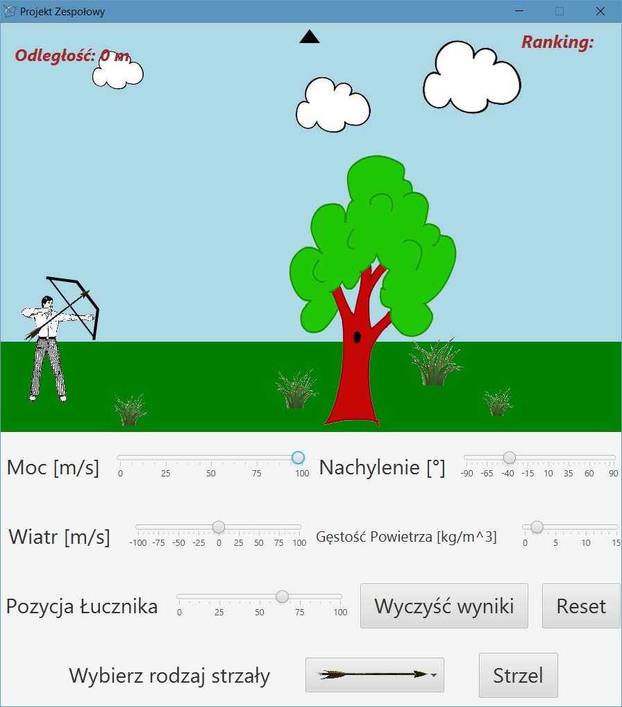
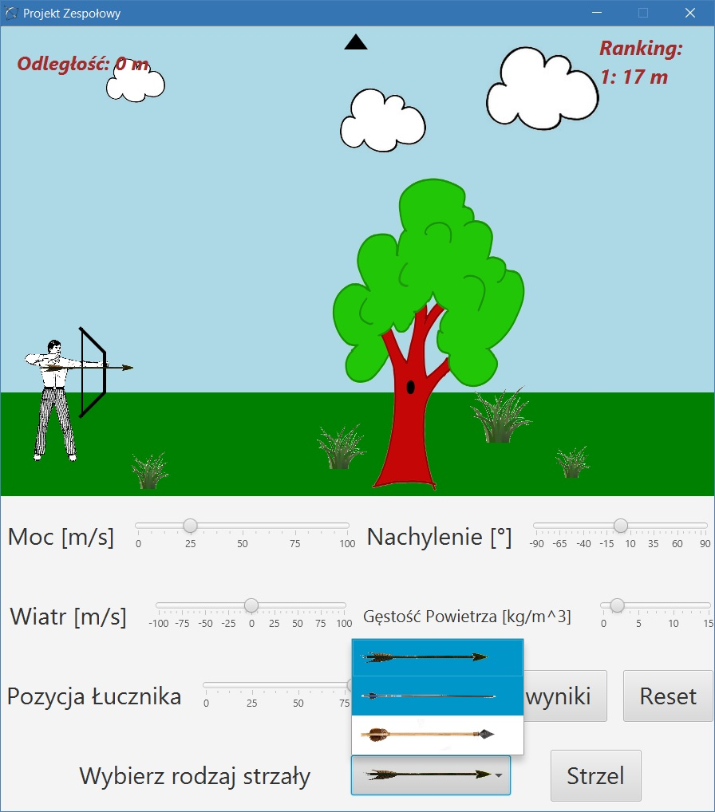
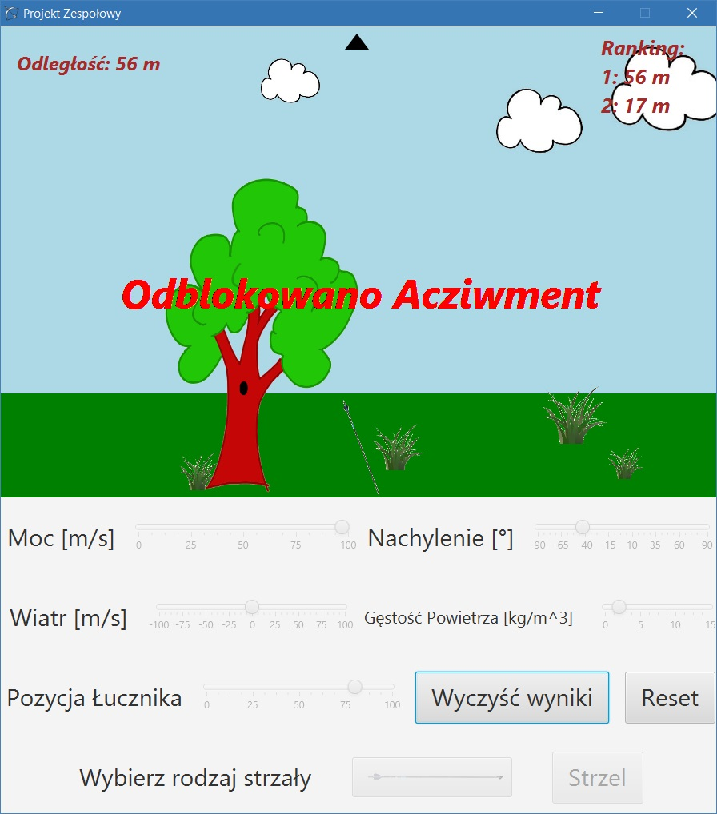
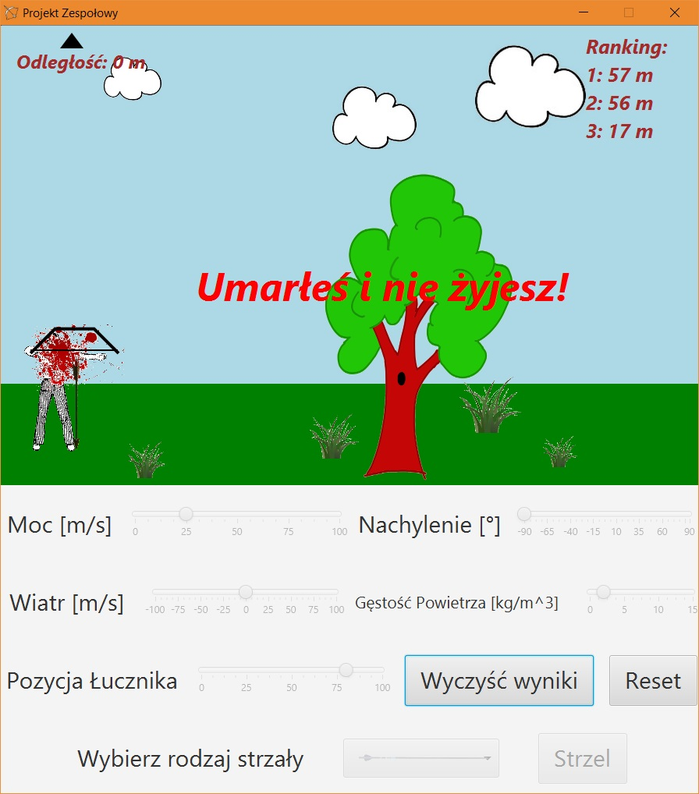
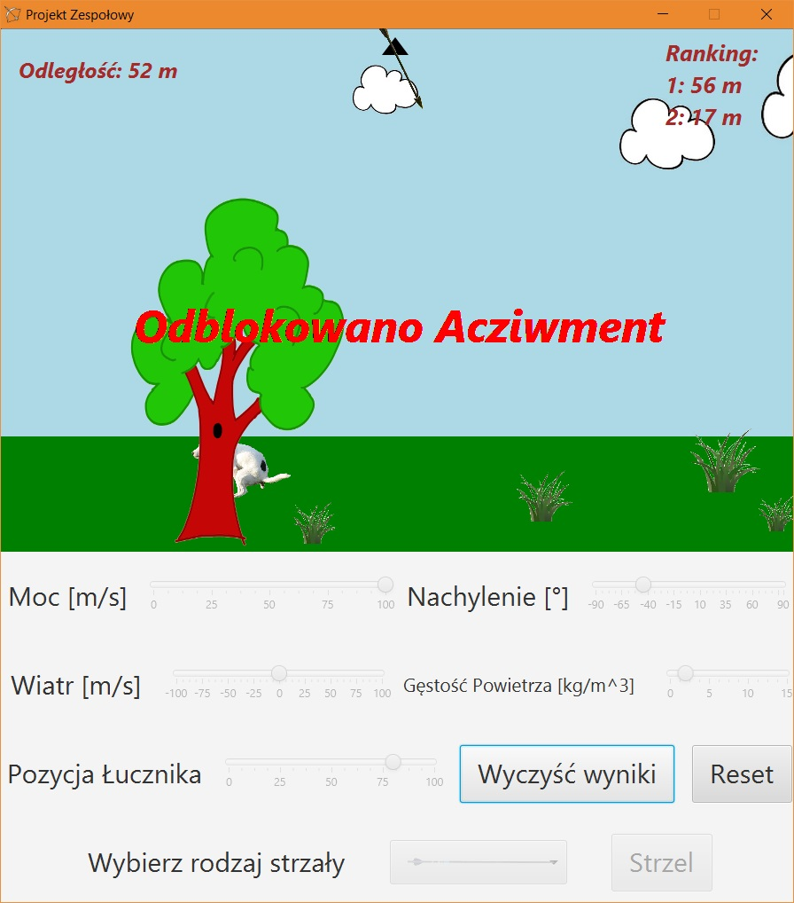
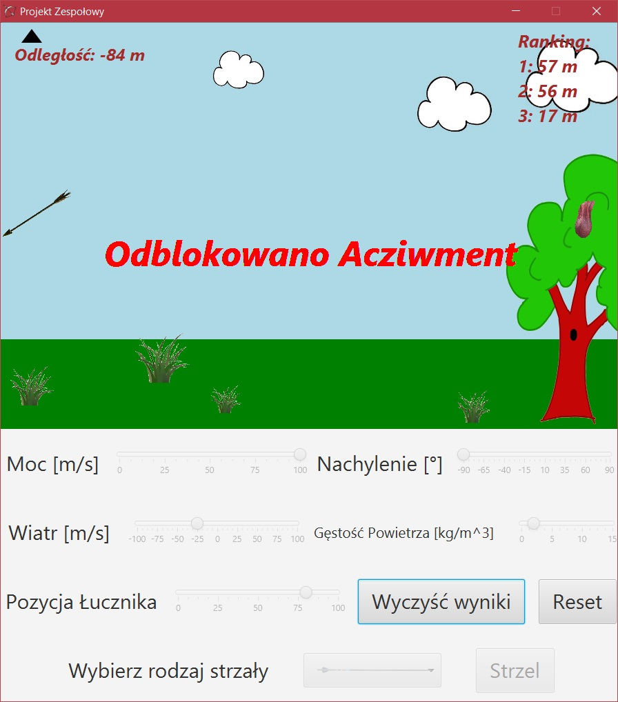

# ProjektZespolowy

# [PL]
Aplikacja będąca projektem zaliczeniowym przedmiotu na uczelni, w której należało wykonać fizykę ruchu strzały zależnej od wielu czynników takich jak wiatr, gęstość powietrza itp. W aplikacji zostało przygotowane menu z podstawowymi suwakami do ustawiania danych o wietrze, gęstości powietrza, położeniu strzały, nachyleniu mocy oraz innych wartości. Aplikacja została napisana przy użyciu języka Java i biblioteki graficznej JavaFX. Wykonaną przez mnie częścią jest logika aplikacji, sterowanie modelami w aplikacji oraz jej wygląd. Fizyka aplikacji została wykonana przez: [szymekTS](https://github.com/szymekTS)

# [EN]
Application that is a subject final project at the university, where you had to make the arrow movement physics depending on many factors such as wind, air density, etc. The application has a menu with basic sliders for setting wind data, air density, arrow position, power slope and other values. The application was written using Java and the JavaFX graphic library. The part that I have made is application logic, model control in the application and its appearance. Application physics has been made by: [szymekTS] (https://github.com/szymekTS)

## Screens

 
*Okno panelu głównego*
 
*Main panel window*

 
*Okno panelu głównego. Do wyboru są trzy strzały (lekka, normalna, ciężka), które mają wpływ na długość lotu.*
 
*Main panel window. You can choose from three arrows (light, normal, heavy) that affect the length of the flight.*

 
*Okno panelu głównego. Widok strzały w locie.*
 
*Main panel window. A view of shots in flight.*

 
*Widok po zdobyciu osiągnięcia. Zostaje ono przyznane po osiągnięciu zadanego dystansu.*
 
*View after gaining achievement. It is granted after reaching the desired distance.*

 
*Po strzeleniu w samego siebie zostanie wyświetlony stosowny komunikat oraz widok krwi.*
 
*After shooting yourself, the appropriate message will be displayed and the blood will be displayed.*

 
*Po osiągnięciu pewnego dystansu dostępny jest Easter Egg :D *
 
*After reaching a certain distance, Easter Egg is available :D*

 
*Po osiągnięciu pewnego dystansu (w odwrotnym kierunku) dostępny jest kolejny Easter Egg :D *
 
*After reaching a certain distance (in the opposite direction), another Easter Egg is available :D*

